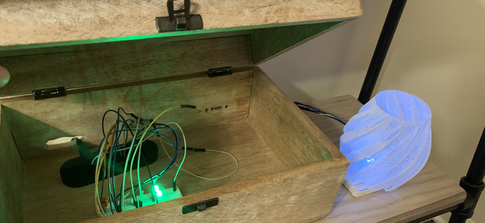

# Weather Lamp



This is a project where you can build a Weather Lamp with a Raspberry Pi. This goes with my [blog post](https://rhythmandbinary.com/post/2021-02-28-raspberry-pi-iot-weather-lamp) and YouTube video on the same topic. I have full instructions on how to setup this project in my blog post. Please refer to the information below and the blog post if you'd like to build this yourself.

## Materials

To do this project, you should have the following:

1. [Raspberry Pi Zero W starter kit including power supply and SD card](https://www.amazon.com/CanaKit-Raspberry-Wireless-Complete-Starter/dp/B072N3X39J/ref=sr_1_4?dchild=1&keywords=raspberry+pi+zero+w&qid=1614533683&sr=8-4)
2. [Bread Board](https://www.amazon.com/Breadboards-Solderless-Breadboard-Distribution-Connecting/dp/B07DL13RZH/ref=sr_1_8?dchild=1&keywords=breadboard&qid=1614533748&sr=8-8)
3. [LED lights and resistors](https://www.amazon.com/dp/B01ERP6WL4/ref=cm_sw_em_r_mt_dp_N4KN1CKWQSMCA4KQJ352)
4. [Jumper Wires](https://www.amazon.com/dp/B07GD2BWPY/ref=cm_sw_em_r_mt_dp_QDH5R89007RT4EGHH6Q0)

You can get the Bread Board, LED Lights, Resistors, and Jumper Wires in kits on Amazon.

I also 3D printed the actual lamp itself, but you can buy votive covers and other DIY solutions instead. The files for the 3D printed model are in the [lamp-model](./lamp-model) folder. I also reference the source from Thingiverse in the credits at the bottom of this README. I printed my lamp with White Filament and 0% infill.

## Setting Up Your Raspberry Pi

I used a Raspberry Pi Zero W for this project. I have included an associated wiring diagram at [wiring-diagram](./wiring-diagram/raspberry_pi_zero_w_gpio.png)

## Python Scripts

[first_light](./first_light.py)

- verifies that lights work
- makes light connected to GPIO pin 21 lightup

[local_weather](./local_weather.py)

- setup actual call to NOAA weather APIs
- also sets up logging and basic logic for colors

[verify_lights](./verify_lights.py)

- verifies all lights are connected to the applicable GPIO pins
- walks through all the connections and makes the lights turn on for 1 second

[weather_light](./weather_light.py)

- final solution
- calls weather service and then turns on the applicable LED lights based on response
- logs all the information in the `history_daily.log` file
- is called by a cron job once an hour

## Shell Scripts

[UPLOAD_PI.sh](./UPLOAD_PI.sh)

- helper script that uploads this project to your Raspberry Pi with SCP

[COPY_LOCAL.sh](./COPY_LOCAL.sh)

- helper script that downloads the project from the Raspberry Pi to your local machine

## Cron Jobs

On the Raspberry Pi I had these two jobs (viewed by running `crontab -e` while shelled into a Raspberry Pi):

```bash
0 * * * * python3 /home/pi/weather-lamp/weather_light.py
30 15 * * * python3 /home/pi/weather-lamp/cleanup_files.py
```

The first job runs the `weather_light.py` program once an hour.

The second job deletes the `history_daily.log` file once a day to avoid the file getting too big.

## Helpful Links

When working on this project I found this tutorial on PiHut super helpful
https://thepihut.com/blogs/raspberry-pi-tutorials/27968772-turning-on-an-led-with-your-raspberry-pis-gpio-pins

## Credits

I got the GPIO header image from
https://raspberrypi.stackexchange.com/questions/83610/gpio-pinout-orientation-raspberypi-zero-w

I got the lamp model from
https://www.thingiverse.com/thing:31722
